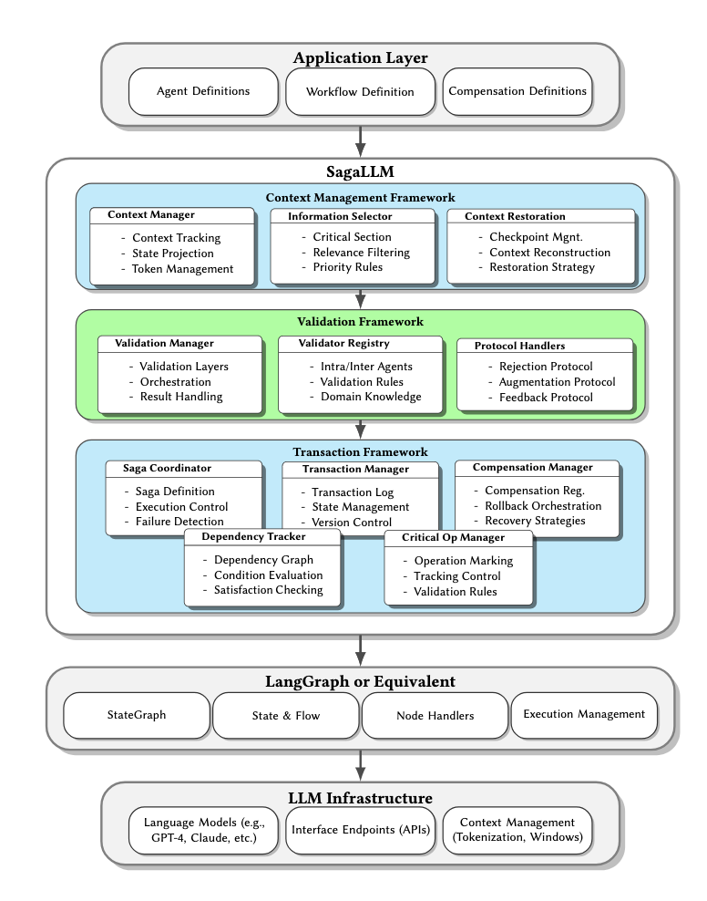
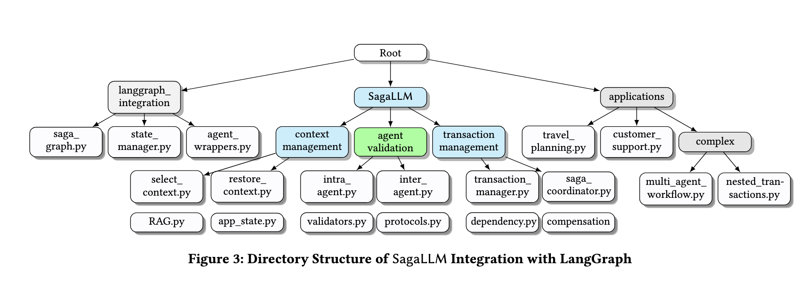

# **SagaLLM: Context Management, Validation, and Transaction Guarantees for Multi-Agent LLM Planning**
<p align="center">
  ⬇️ <a href="https://github.com/genglongling/REALM-Bench?tab=readme-ov-file">Github</a>  
  📃 <a href="https://arxiv.org/abs/2502.18836">Paper</a>  
  🌐 <a href="https://example.com/project">Project Page</a>
</p>

This repository extends based on the REALM-Bench (a general mutli-agent framework for of real-world use cases of Multi Agentic Design, Orchestration, and Planning in Real-World Scenerios).
The SagaLLM provides a **comprehensive middleware** for agent application layer and multi-agent databases.

  
1. It supports **Application Layer** for:
    - **Planning and Scheduling:** 1) Sequential planning, 2) Reactive planning, 3) Complex planning, 4) Others
   - **Tool Use:** 1) WriteToFile, 2) GoogleSearchAPI, 3) Other API (e.g. Financial), 4) Others
   - **Reflection**
   - **Memory**
   - **Reasoning**
   - **Forecasting**
   - **Math Induction, Calculation**
   - **Multi-Agent Collaboration**: worflow generation

2. It supports **Multi-Agent Database Frameworks** across 7 different agent ecosystems:  
   - **AutoGen**  
   - **CrewAI**  
   - **Swarm**  
   - **LangGraph**  

---
## **Key Functions of `Saga` libraries**

- 1) Context Management Framework
- 2) Validation Framework
- 3) Transaction Framework
- 4) Extension of multi-agent frameworks,
- 5) Built for application layers.
     

| **Function**            | **Description**                                      | **Function Name**                      | **Input**                                      |
|-------------------------|------------------------------------------------------|-----------------------------------------|------------------------------------------------|
| **Transaction Manager** | Defines context, agents, and dependencies.          | `transaction_manager(self, agents, dependencies, context)` | List of agents, dependencies, and context.   |
| **Saga Coordinator**    | Executes agents with optional rollback support.     | `saga_coordinator(self, with_rollback, agents)` | `with_rollback` (boolean flag), agent list.  |
| **Intra-Agent Details** | Prints each agent’s execution details.              | `intra_agent(self, agents)`            | Agent list.                                   |
| **Inter-Agent Dependencies** | Displays inter-agent dependencies.          | `inter_agent(self, dependency_graph)`  | Agent dependency graph.                      |
| **Select Context**      | Allows user to query execution context of a node.   | `select_context(self, node_name)`       | User-input node name.                         |
| **Restore Context**     | Rolls back execution of a specified agent.          | `restore_context(self, agent_name)`     | User-input agent to rollback.                |


---

## **🔹 Key Features of Using `SagaCoordinator` Instead of Previous `Crew`**

| Feature             | Crew                                        | SagaCoordinator                     |
|---------------------|-------------------------------------------|------------------------------------|
| **Task Execution**  | Runs agents in topological order          | Runs agents sequentially with rollback |
| **Error Handling**  | No built-in error handling                | Rolls back on failure               |
| **Transaction Safety** | No rollback mechanism                  | Full rollback support               |
| **Use Case**        | Dependency management                     | Resilient transaction flow          |

---

## **🚀 How To Run**  

### **1️⃣ Setup Environment**  
Follow these steps to get started:  

- **Create a virtual environment**  
  ```bash
  python3 -m venv venv
  ```
  making sure your program using python==3.10+ for your venv on your editor.
  
- **Activate the virtual environment**  
  - macOS/Linux:  
    ```bash
    source venv/bin/activate
    ```  
  - Windows:  
    ```bash
    venv\Scripts\activate
    ```  
- **Install dependencies**  
  ```bash
  pip install -r requirements.txt
  ```  
- **Set up OpenAI API credentials**  
  - Create a `.env` file in the root directory  
  - Add your OpenAI API key:  
    ```env
    OPENAI_API_KEY="sk-proj-..."
    ```  
- **Run Jupyter Notebook**  
  ```bash
  jupyter notebook
  ```  
  - Open and modify `design_patterns/multiagent.ipynb` to create your **specialized multi-agent use case**.  

---

### **2️⃣ Running Multi-Agent Frameworks**
(Optional) You can execute agents using one of the frameworks:  

- **Run an agent framework**  
  ```bash
  python agent_frameworks/openai_swarm_agent.py
  ```  
- **Using AutoGen**  
  - Ensure **Docker** is installed ([Get Docker](https://docs.docker.com/get-started/get-docker/))  
  - Start Docker before running AutoGen-based agents  

---
### **3️⃣ Import Saga Library**
(Optional) You can execute transaction using sage:  


  ```
  cd applications
  ```

and edit the "multiagent-p5.py" following the below coding format.

--- 
## **Example 1: Wedding Logsitics Planning**

input for example 1:

```
import sys
import os


# Get the project root by going up one level from 'applications'
project_root = os.path.abspath(os.path.join(os.getcwd(), '..'))
print(f"📂 Project Root: {project_root}")

# Append 'src' directory to sys.path
src_path = os.path.join(project_root, 'src')
sys.path.append(src_path)

# Print sys.path to verify
print("🔍 Updated sys.path:")
for path in sys.path:
    print(path)

# Try importing Saga again
try:
    from multi_agent.saga import Saga
    from multi_agent.agent import Agent
    print("✅ Saga imported successfully!")
    print("✅ Agent imported successfully!")
except ModuleNotFoundError as e:
    print("❌ Import failed:", e)


# Initialize Saga
saga = Saga()

LT_Agent = Agent(
    name="Locations and Time Setup Agent",
    backstory="You define locations, travel times, and guest arrival schedules.",
    task_description="Set up locations, travel times, and ensure accurate scheduling of arrivals.",
    task_expected_output="Structured location data and expected arrival times. Fourlocations:𝑉 ={𝐵,𝐺,𝑇,𝑊},where𝐵isBostonAir- port, 𝐺 is Gift shop, 𝑇 is Tailor shop, and 𝑊 is Wedding venue. 𝐵-𝐺 : 45, 𝐵-𝑇 : 30, 𝐵-𝑊 : 40, 𝐺-𝑇 : 20, 𝐺-𝑊 : 25, 𝑇-𝑊 : 15. - Alex:At𝐵at11:00AMfromChicago(needaride) - Jamie:At𝐵at12:30PMfromAtlanta(needaride) - Pat: At 𝑊 at 12:00 PM driving from NYC (has 5-seater car)"
)

# ---- Task Setup Agent ---- #
TS_Agent = Agent(
    name="Task Setup Agent",
    backstory="You manage the scheduling of required wedding tasks.",
    task_description="Schedule gift collection after 12:00 PM, clothes pickup before 2:00 PM, and ensure photo session at 3:00 PM.",
    task_expected_output="Optimized task schedule aligned with constraints."
)

# ---- Resource Management Agent ---- #
RM_Agent = Agent(
    name="Resource Management Agent",
    backstory="You allocate available transport resources efficiently.",
    task_description="Coordinate 5 vehicle usage and Local friend Chris(5-seater)available, for guest transportation and task fulfillment.",
    task_expected_output="Optimized 5 vehicle allocation and friend welcome ensuring timely arrivals. - Onecar(5-seater)withPat,availableafterheisBoston - LocalfriendChris(5-seater)availableafter1:30PMat𝑊"
)

# ---- Constraint Validation Agent ---- #
CV_Agent = Agent(
    name="Constraint Validation Agent",
    backstory="You verify all scheduling constraints to ensure smooth execution.",
    task_description="Ensure all tasks are completed within operating hours and vehicle constraints are met.",
    task_expected_output="Validated schedule with no conflicts. All tasks must complete before 3:00 PM photo time - Gift store opens at 12:00 PM - Tailor closes at 2:00 PM - Two cars must accommodate all transport needs"
)

# ---- Supervisor Agent ---- #
WEO_Agent = Agent(
    name="Wedding Event Oversight Agent",
    backstory="You oversee the entire wedding logistics to ensure a smooth execution of tasks.",
    task_description="Monitor and ensure all tasks are completed on time, resolving any logistical issues.",
    task_expected_output="Give a wedding scheduling plan for people, task and time."
)


# Register Agents in Saga
saga.transaction_manager([LT_Agent, TS_Agent, RM_Agent, CV_Agent, WEO_Agent])

# Execute with rollback enabled
saga.saga_coordinator(with_rollback=True)

# Print intra-agent details
saga.intra_agent()

# Print inter-agent dependencies
saga.inter_agent()

# Select context for an agent
saga.select_context("Resource Management Agent")

# Restore an agent’s execution
saga.restore_context("Resource Management Agent")

```

Output for Example 1:
```
📂 Project Root: /Users/glin/Documents/GitHub/SagaLLM
🔍 Updated sys.path:
/Users/glin/Documents/GitHub/SagaLLM/applications
/usr/local/Cellar/python@3.10/3.10.14/Frameworks/Python.framework/Versions/3.10/lib/python310.zip
/usr/local/Cellar/python@3.10/3.10.14/Frameworks/Python.framework/Versions/3.10/lib/python3.10
/usr/local/Cellar/python@3.10/3.10.14/Frameworks/Python.framework/Versions/3.10/lib/python3.10/lib-dynload
/Users/glin/Documents/GitHub/SagaLLM/venv/lib/python3.10/site-packages
/Users/glin/Documents/GitHub/SagaLLM/src
📂 Project Root: /Users/glin/Documents/GitHub/SagaLLM
🔍 Updated sys.path:
/Users/glin/Documents/GitHub/SagaLLM/applications
/usr/local/Cellar/python@3.10/3.10.14/Frameworks/Python.framework/Versions/3.10/lib/python310.zip
/usr/local/Cellar/python@3.10/3.10.14/Frameworks/Python.framework/Versions/3.10/lib/python3.10
/usr/local/Cellar/python@3.10/3.10.14/Frameworks/Python.framework/Versions/3.10/lib/python3.10/lib-dynload
/Users/glin/Documents/GitHub/SagaLLM/venv/lib/python3.10/site-packages
/Users/glin/Documents/GitHub/SagaLLM/src
/Users/glin/Documents/GitHub/SagaLLM/src
✅ Utils imported successfully!
📂 Project Root: /Users/glin/Documents/GitHub/SagaLLM
🔍 Updated sys.path:
/Users/glin/Documents/GitHub/SagaLLM/applications
/usr/local/Cellar/python@3.10/3.10.14/Frameworks/Python.framework/Versions/3.10/lib/python310.zip
/usr/local/Cellar/python@3.10/3.10.14/Frameworks/Python.framework/Versions/3.10/lib/python3.10
/usr/local/Cellar/python@3.10/3.10.14/Frameworks/Python.framework/Versions/3.10/lib/python3.10/lib-dynload
/Users/glin/Documents/GitHub/SagaLLM/venv/lib/python3.10/site-packages
/Users/glin/Documents/GitHub/SagaLLM/src
/Users/glin/Documents/GitHub/SagaLLM/src
/Users/glin/Documents/GitHub/SagaLLM/src
✅ utils.logging imported successfully!
📂 Project Root: /Users/glin/Documents/GitHub/SagaLLM
🔍 Updated sys.path:
/Users/glin/Documents/GitHub/SagaLLM/applications
/usr/local/Cellar/python@3.10/3.10.14/Frameworks/Python.framework/Versions/3.10/lib/python310.zip
/usr/local/Cellar/python@3.10/3.10.14/Frameworks/Python.framework/Versions/3.10/lib/python3.10
/usr/local/Cellar/python@3.10/3.10.14/Frameworks/Python.framework/Versions/3.10/lib/python3.10/lib-dynload
/Users/glin/Documents/GitHub/SagaLLM/venv/lib/python3.10/site-packages
/Users/glin/Documents/GitHub/SagaLLM/src
/Users/glin/Documents/GitHub/SagaLLM/src
/Users/glin/Documents/GitHub/SagaLLM/src
/Users/glin/Documents/GitHub/SagaLLM/src
✅ tool_agent.tool imported successfully!
✅ utils.completions imported successfully!
✅ utils.extraction imported successfully!
✅ multi_agent.crew imported successfully!
✅ planning_agent.react_agent imported successfully!
✅ tool_agent.tool imported successfully!
✅ Saga imported successfully!
✅ Agent imported successfully!

==================================================
🛠 Transaction Manager: Agents and dependencies initialized.
==================================================


==================================================
🚀 Running Agent: Locations and Time Setup Agent
==================================================

✅ Locations and Time Setup Agent completed successfully.

==================================================
🚀 Running Agent: Task Setup Agent
==================================================

✅ Task Setup Agent completed successfully.

==================================================
🚀 Running Agent: Resource Management Agent
==================================================

✅ Resource Management Agent completed successfully.

==================================================
🚀 Running Agent: Constraint Validation Agent
==================================================

✅ Constraint Validation Agent completed successfully.

==================================================
🚀 Running Agent: Wedding Event Oversight Agent
==================================================

✅ Wedding Event Oversight Agent completed successfully.

📌 **Intra-Agent Execution Details**
🔹 Locations and Time Setup Agent: <locations>
  <location id="B" name="Boston Airport"/>
  <location id="G" name="Gift shop"/>
  <location id="T" name="Tailor shop"/>
  <location id="W" name="Wedding venue"/>
</locations>

<travel_times>
  <from to="G" time="45">B</from>
  <from to="T" time="30">B</from>
  <from to="W" time="40">B</from>
  <from to="T" time="20">G</from>
  <from to="W" time="25">G</from>
  <from to="W" time="15">T</from>
</travel_times>

<guest_arrivals>
  <guest name="Alex" location="B" time="11:00 AM" from="Chicago" needs_ride="yes"/>
  <guest name="Jamie" location="B" time="12:30 PM" from="Atlanta" needs_ride="yes"/>
  <guest name="Pat" location="W" time="12:00 PM" from="NYC" has_car="5-seater"/>
</guest_arrivals>
🔹 Task Setup Agent: To create an optimized task schedule aligned with the given constraints, the tasks should be arranged as follows:

1. **Clothes Pickup**: Schedule this task before 2:00 PM. It's important to complete this task early to ensure there is enough time for any unforeseen delays and to have the clothes ready for the photo session.

2. **Gift Collection**: Schedule this task after 12:00 PM. This allows flexibility to complete it after the clothes pickup and before the photo session, ensuring all tasks are completed efficiently.

3. **Photo Session**: Schedule this task at 3:00 PM as specified. This is a fixed time and should be adhered to precisely.

**Optimized Task Schedule:**

- 11:00 AM - 1:30 PM: Clothes Pickup
- 1:30 PM - 2:30 PM: Gift Collection
- 3:00 PM: Photo Session

This schedule ensures all tasks are completed within their respective time constraints and allows for a smooth flow of activities leading up to the photo session.
🔹 Resource Management Agent: Optimized 5 vehicle allocation and friend welcome ensuring timely arrivals. - Onecar (5-seater) with Pat, available after he is Boston - Local friend Chris (5-seater) available after 1:30 PM at 𝑊
🔹 Constraint Validation Agent: To ensure that all tasks are completed within the specified operating hours and vehicle constraints, we need to create a schedule that adheres to the following conditions:

1. **Operating Hours:**
   - All tasks must be completed before 3:00 PM.
   - The gift store opens at 12:00 PM.
   - The tailor closes at 2:00 PM.

2. **Vehicle Constraints:**
   - Two cars are available to accommodate all transport needs.

**Validated Schedule:**

- **Task 1: Visit Tailor**
  - **Start Time:** 10:00 AM
  - **End Time:** 11:00 AM
  - **Notes:** Ensure this task is completed before the tailor closes at 2:00 PM.

- **Task 2: Visit Gift Store**
  - **Start Time:** 12:00 PM
  - **End Time:** 1:00 PM
  - **Notes:** This task must start no earlier than 12:00 PM when the gift store opens.

- **Task 3: Photo Session**
  - **Start Time:** 1:30 PM
  - **End Time:** 2:30 PM
  - **Notes:** Ensure this task is completed before 3:00 PM.

**Vehicle Allocation:**

- **Car 1:**
  - Transport for Task 1 (Visit Tailor) and Task 3 (Photo Session).

- **Car 2:**
  - Transport for Task 2 (Visit Gift Store).

This schedule ensures that all tasks are completed within the operating hours, and the two cars are used efficiently to accommodate all transport needs without any conflicts.
🔹 Wedding Event Oversight Agent: To ensure a smooth execution of the wedding logistics, here's a detailed wedding scheduling plan that outlines the tasks, responsible people, and timing:

**Wedding Day Schedule:**

**Morning Preparations:**

- **6:00 AM - 7:00 AM: Hair and Makeup for Bride and Bridesmaids**
  - **Responsible:** Hair and Makeup Artists
  - **Location:** Bridal Suite

- **7:00 AM - 8:00 AM: Groom and Groomsmen Getting Ready**
  - **Responsible:** Groom and Groomsmen
  - **Location:** Groom's Suite

- **8:00 AM - 9:00 AM: Final Touches and Photos**
  - **Responsible:** Photographer
  - **Location:** Various locations around the venue

**Ceremony:**

- **10:00 AM - 10:30 AM: Guest Arrival and Seating**
  - **Responsible:** Ushers
  - **Location:** Ceremony Venue

- **10:30 AM - 11:00 AM: Wedding Ceremony**
  - **Responsible:** Officiant
  - **Location:** Ceremony Venue

**Post-Ceremony:**

- **11:00 AM - 11:30 AM: Family and Group Photos**
  - **Responsible:** Photographer
  - **Location:** Ceremony Venue

- **11:30 AM - 12:00 PM: Cocktail Hour**
  - **Responsible:** Catering Staff
  - **Location:** Reception Area

**Reception:**

- **12:00 PM - 12:30 PM: Guests Seated for Reception**
  - **Responsible:** Ushers
  - **Location:** Reception Hall

- **12:30 PM - 1:00 PM: Wedding Party Entrance and First Dance**
  - **Responsible:** DJ/Band
  - **Location:** Reception Hall

- **1:00 PM - 2:00 PM: Lunch/Dinner Service**
  - **Responsible:** Catering Staff
  - **Location:** Reception Hall

- **2:00 PM - 2:30 PM: Speeches and Toasts**
  - **Responsible:** Best Man, Maid of Honor, Parents
  - **Location:** Reception Hall

- **2:30 PM - 3:00 PM: Cake Cutting Ceremony**
  - **Responsible:** Bride and Groom
  - **Location:** Reception Hall

- **3:00 PM - 4:00 PM: Dancing and Entertainment**
  - **Responsible:** DJ/Band
  - **Location:** Reception Hall

**Evening:**

- **4:00 PM - 5:00 PM: Bouquet and Garter Toss**
  - **Responsible:** Bride and Groom
  - **Location:** Reception Hall

- **5:00 PM - 6:00 PM: Farewell and Guest Departure**
  - **Responsible:** Wedding Planner
  - **Location:** Venue Exit

**Post-Wedding:**

- **6:00 PM - 7:00 PM: Clean-Up and Vendor Pack-Up**
  - **Responsible:** Venue Staff and Vendors
  - **Location:** Entire Venue

This schedule ensures that all tasks are assigned to the appropriate people and are completed on time, allowing for a seamless and enjoyable wedding day.

🔗 **Inter-Agent Dependencies**
🔸 Locations and Time Setup Agent depends on: None
🔸 Task Setup Agent depends on: None
🔸 Resource Management Agent depends on: None
🔸 Constraint Validation Agent depends on: None
🔸 Wedding Event Oversight Agent depends on: None

🎯 **Context for Resource Management Agent:**
Optimized 5 vehicle allocation and friend welcome ensuring timely arrivals. - Onecar (5-seater) with Pat, available after he is Boston - Local friend Chris (5-seater) available after 1:30 PM at 𝑊
🔄 Rolling back Resource Management Agent's operation...
🔄 Resource Management Agent rolled back successfully.

```
--- 
## **Example 2: Thanksgiving Dinner Planning**
input for example 2:
```
import sys
import os


# Get the project root by going up one level from 'applications'
project_root = os.path.abspath(os.path.join(os.getcwd(), '..'))
print(f"📂 Project Root: {project_root}")

# Append 'src' directory to sys.path
src_path = os.path.join(project_root, 'src')
sys.path.append(src_path)

# Print sys.path to verify
print("🔍 Updated sys.path:")
for path in sys.path:
    print(path)

# Try importing Saga again
try:
    from multi_agent.saga import Saga
    from multi_agent.agent import Agent
    print("✅ Saga imported successfully!")
    print("✅ Agent imported successfully!")
except ModuleNotFoundError as e:
    print("❌ Import failed:", e)


# Initialize Saga
saga = Saga()

# ---- Member & Time Setup Agent ---- #
MT_Agent = Agent(
    name="Member & Time Setup Agent",
    backstory="You track family members' arrivals and ensure accurate scheduling.",
    task_description="Set up arrival times, locations, and travel durations for all family members.",
    task_expected_output="Structured schedule ensuring all members arrive on time for dinner. - Sarah(Mom):Host,athome, - James(Dad):LandsatBOS1:00PMfromSF, - Emily(Sister):LandsatBOS2:30PMfromChicago - Michael(Brother):Driving,arrives3:00PMfromNY - Grandma:NeedspickupfromsuburbanBoston"
)

# ---- Requirement Setup Agent ---- #
RS_Agent = Agent(
    name="Requirement Setup Agent",
    backstory="You manage cooking schedules and key logistical needs.",
    task_description="Schedule turkey and side dish preparation while ensuring someone stays home for supervision.",
    task_expected_output="Optimized cooking schedule aligning with dinner timing. cooking requirements:  -Turkey:4hourscookingtime, - Sidedishes:2hourspreparation, - Someonemuststayhomeduringcooking, "
)

# ---- Constraint Validation Agent ---- #
CV_Agent = Agent(
    name="Constraint Validation Agent",
    backstory="You verify all scheduling constraints and ensure compliance.",
    task_description="Validate that all pickups, cooking timelines, and supervision requirements are met.",
    task_expected_output="A conflict-free schedule ensuring all tasks are completed efficiently. - Jamesmustrentcarafterlanding, - Emilyrequiresairportpickup ,- Traveltimes: – HometoBOSAirport:60min – BOSAirporttoGrandma’s:60min – HometoGrandma’s:30min"
)

# ---- Supervisor Agent ---- #
SA_Agent = Agent(
    name="Supervisor Agent",
    backstory="You oversee all logistical elements and generate the final dinner preparation report.",
    task_description="Monitor and report on key tasks, including cooking start time, Emily's pickup, and Grandma's pickup.",
    task_expected_output="Comprehensive report detailing dinner preparation logistics and arrivals. key requirement: - Allfamilymembersathomefor6:00PMdinner - Turkeyandsidesreadybydinnertime - Allpickupscompletedwithavailabledrivers - Cookingsupervisionmaintained"
)

# Register Agents in Saga
saga.transaction_manager([MT_Agent, RS_Agent, CV_Agent, SA_Agent])

# Execute with rollback enabled
saga.saga_coordinator(with_rollback=True)

# Print intra-agent details
saga.intra_agent()

# Print inter-agent dependencies
saga.inter_agent()

# Select context for an agent
saga.select_context("Member & Time Setup Agent")

# Restore an agent’s execution
saga.restore_context("Member & Time Setup Agent")

```

output for example 2:
```
📂 Project Root: /Users/glin/Documents/GitHub/SagaLLM
🔍 Updated sys.path:
/Users/glin/Documents/GitHub/SagaLLM/applications
/usr/local/Cellar/python@3.10/3.10.14/Frameworks/Python.framework/Versions/3.10/lib/python310.zip
/usr/local/Cellar/python@3.10/3.10.14/Frameworks/Python.framework/Versions/3.10/lib/python3.10
/usr/local/Cellar/python@3.10/3.10.14/Frameworks/Python.framework/Versions/3.10/lib/python3.10/lib-dynload
/Users/glin/Documents/GitHub/SagaLLM/venv/lib/python3.10/site-packages
/Users/glin/Documents/GitHub/SagaLLM/src
📂 Project Root: /Users/glin/Documents/GitHub/SagaLLM
🔍 Updated sys.path:
/Users/glin/Documents/GitHub/SagaLLM/applications
/usr/local/Cellar/python@3.10/3.10.14/Frameworks/Python.framework/Versions/3.10/lib/python310.zip
/usr/local/Cellar/python@3.10/3.10.14/Frameworks/Python.framework/Versions/3.10/lib/python3.10
/usr/local/Cellar/python@3.10/3.10.14/Frameworks/Python.framework/Versions/3.10/lib/python3.10/lib-dynload
/Users/glin/Documents/GitHub/SagaLLM/venv/lib/python3.10/site-packages
/Users/glin/Documents/GitHub/SagaLLM/src
/Users/glin/Documents/GitHub/SagaLLM/src
✅ Utils imported successfully!
📂 Project Root: /Users/glin/Documents/GitHub/SagaLLM
🔍 Updated sys.path:
/Users/glin/Documents/GitHub/SagaLLM/applications
/usr/local/Cellar/python@3.10/3.10.14/Frameworks/Python.framework/Versions/3.10/lib/python310.zip
/usr/local/Cellar/python@3.10/3.10.14/Frameworks/Python.framework/Versions/3.10/lib/python3.10
/usr/local/Cellar/python@3.10/3.10.14/Frameworks/Python.framework/Versions/3.10/lib/python3.10/lib-dynload
/Users/glin/Documents/GitHub/SagaLLM/venv/lib/python3.10/site-packages
/Users/glin/Documents/GitHub/SagaLLM/src
/Users/glin/Documents/GitHub/SagaLLM/src
/Users/glin/Documents/GitHub/SagaLLM/src
✅ utils.logging imported successfully!
📂 Project Root: /Users/glin/Documents/GitHub/SagaLLM
🔍 Updated sys.path:
/Users/glin/Documents/GitHub/SagaLLM/applications
/usr/local/Cellar/python@3.10/3.10.14/Frameworks/Python.framework/Versions/3.10/lib/python310.zip
/usr/local/Cellar/python@3.10/3.10.14/Frameworks/Python.framework/Versions/3.10/lib/python3.10
/usr/local/Cellar/python@3.10/3.10.14/Frameworks/Python.framework/Versions/3.10/lib/python3.10/lib-dynload
/Users/glin/Documents/GitHub/SagaLLM/venv/lib/python3.10/site-packages
/Users/glin/Documents/GitHub/SagaLLM/src
/Users/glin/Documents/GitHub/SagaLLM/src
/Users/glin/Documents/GitHub/SagaLLM/src
/Users/glin/Documents/GitHub/SagaLLM/src
✅ tool_agent.tool imported successfully!
✅ utils.completions imported successfully!
✅ utils.extraction imported successfully!
✅ multi_agent.crew imported successfully!
✅ planning_agent.react_agent imported successfully!
✅ tool_agent.tool imported successfully!
✅ Saga imported successfully!
✅ Agent imported successfully!

==================================================
🛠 Transaction Manager: Agents and dependencies initialized.
==================================================

Traceback (most recent call last):
  File "/Users/glin/Documents/GitHub/SagaLLM/applications/multiagent-p6.py", line 71, in <module>
    saga.saga_coordinator(with_rollback=True)
  File "/Users/glin/Documents/GitHub/SagaLLM/src/multi_agent/saga.py", line 61, in saga_coordinator
    sorted_agents = self.topological_sort()
  File "/Users/glin/Documents/GitHub/SagaLLM/src/multi_agent/saga.py", line 144, in topological_sort
    in_degree[dependent] -= 1
KeyError: Constraint Validation Agent
(venv) (base) glin@glindeMacBook-Pro applications % python3 multiagent-p6.py
📂 Project Root: /Users/glin/Documents/GitHub/SagaLLM
🔍 Updated sys.path:
/Users/glin/Documents/GitHub/SagaLLM/applications
/usr/local/Cellar/python@3.10/3.10.14/Frameworks/Python.framework/Versions/3.10/lib/python310.zip
/usr/local/Cellar/python@3.10/3.10.14/Frameworks/Python.framework/Versions/3.10/lib/python3.10
/usr/local/Cellar/python@3.10/3.10.14/Frameworks/Python.framework/Versions/3.10/lib/python3.10/lib-dynload
/Users/glin/Documents/GitHub/SagaLLM/venv/lib/python3.10/site-packages
/Users/glin/Documents/GitHub/SagaLLM/src
📂 Project Root: /Users/glin/Documents/GitHub/SagaLLM
🔍 Updated sys.path:
/Users/glin/Documents/GitHub/SagaLLM/applications
/usr/local/Cellar/python@3.10/3.10.14/Frameworks/Python.framework/Versions/3.10/lib/python310.zip
/usr/local/Cellar/python@3.10/3.10.14/Frameworks/Python.framework/Versions/3.10/lib/python3.10
/usr/local/Cellar/python@3.10/3.10.14/Frameworks/Python.framework/Versions/3.10/lib/python3.10/lib-dynload
/Users/glin/Documents/GitHub/SagaLLM/venv/lib/python3.10/site-packages
/Users/glin/Documents/GitHub/SagaLLM/src
/Users/glin/Documents/GitHub/SagaLLM/src
✅ Utils imported successfully!
📂 Project Root: /Users/glin/Documents/GitHub/SagaLLM
🔍 Updated sys.path:
/Users/glin/Documents/GitHub/SagaLLM/applications
/usr/local/Cellar/python@3.10/3.10.14/Frameworks/Python.framework/Versions/3.10/lib/python310.zip
/usr/local/Cellar/python@3.10/3.10.14/Frameworks/Python.framework/Versions/3.10/lib/python3.10
/usr/local/Cellar/python@3.10/3.10.14/Frameworks/Python.framework/Versions/3.10/lib/python3.10/lib-dynload
/Users/glin/Documents/GitHub/SagaLLM/venv/lib/python3.10/site-packages
/Users/glin/Documents/GitHub/SagaLLM/src
/Users/glin/Documents/GitHub/SagaLLM/src
/Users/glin/Documents/GitHub/SagaLLM/src
✅ utils.logging imported successfully!
📂 Project Root: /Users/glin/Documents/GitHub/SagaLLM
🔍 Updated sys.path:
/Users/glin/Documents/GitHub/SagaLLM/applications
/usr/local/Cellar/python@3.10/3.10.14/Frameworks/Python.framework/Versions/3.10/lib/python310.zip
/usr/local/Cellar/python@3.10/3.10.14/Frameworks/Python.framework/Versions/3.10/lib/python3.10
/usr/local/Cellar/python@3.10/3.10.14/Frameworks/Python.framework/Versions/3.10/lib/python3.10/lib-dynload
/Users/glin/Documents/GitHub/SagaLLM/venv/lib/python3.10/site-packages
/Users/glin/Documents/GitHub/SagaLLM/src
/Users/glin/Documents/GitHub/SagaLLM/src
/Users/glin/Documents/GitHub/SagaLLM/src
/Users/glin/Documents/GitHub/SagaLLM/src
✅ tool_agent.tool imported successfully!
✅ utils.completions imported successfully!
✅ utils.extraction imported successfully!
✅ multi_agent.crew imported successfully!
✅ planning_agent.react_agent imported successfully!
✅ tool_agent.tool imported successfully!
✅ Saga imported successfully!
✅ Agent imported successfully!

==================================================
🛠 Transaction Manager: Agents and dependencies initialized.
==================================================


==================================================
🚀 Running Agent: Member & Time Setup Agent
==================================================

✅ Member & Time Setup Agent completed successfully.

==================================================
🚀 Running Agent: Requirement Setup Agent
==================================================

✅ Requirement Setup Agent completed successfully.

==================================================
🚀 Running Agent: Constraint Validation Agent
==================================================

✅ Constraint Validation Agent completed successfully.

==================================================
🚀 Running Agent: Supervisor Agent
==================================================

✅ Supervisor Agent completed successfully.

📌 **Intra-Agent Execution Details**
🔹 Member & Time Setup Agent: Structured schedule ensuring all members arrive on time for dinner.

- Sarah(Mom): Host, at home
- James(Dad): Lands at BOS 1:00 PM from SF
- Emily(Sister): Lands at BOS 2:30 PM from Chicago
- Michael(Brother): Driving, arrives 3:00 PM from NY
- Grandma: Needs pickup from suburban Boston
🔹 Requirement Setup Agent: To create an optimized cooking schedule that aligns with dinner timing while ensuring someone stays home for supervision, let's assume dinner is planned for 6:00 PM. Here's a suggested schedule:

1. **Turkey Preparation and Cooking:**
   - **Start Time:** 12:00 PM
   - **End Time:** 4:00 PM
   - **Details:** The turkey requires 4 hours of cooking time. Begin preparation and cooking at noon to ensure it's ready by 4:00 PM.

2. **Side Dishes Preparation:**
   - **Start Time:** 4:00 PM
   - **End Time:** 6:00 PM
   - **Details:** The side dishes require 2 hours of preparation. Start immediately after the turkey is done to have everything ready by dinner time.

3. **Home Supervision:**
   - **Requirement:** Ensure someone is home from 12:00 PM to 6:00 PM to oversee the cooking process.

This schedule ensures that both the turkey and side dishes are freshly prepared and ready by dinner time, while also maintaining supervision throughout the cooking process.
🔹 Constraint Validation Agent: To create a conflict-free schedule that ensures all tasks are completed efficiently, we need to consider the travel times and requirements provided:

1. **James must rent a car after landing.**
2. **Emily requires airport pickup.**
3. **Travel times:**
   - Home to BOS Airport: 60 min
   - BOS Airport to Grandma’s: 60 min
   - Home to Grandma’s: 30 min

**Proposed Schedule:**

- **James's Schedule:**
  - **Landing at BOS Airport:** James lands at a specific time (let's assume 10:00 AM for this schedule).
  - **Car Rental:** James rents a car immediately after landing. Allowing 30 minutes for the car rental process, he will be ready to leave the airport by 10:30 AM.
  - **Travel to Grandma’s:** James drives from BOS Airport to Grandma’s, which takes 60 minutes. He will arrive at Grandma’s by 11:30 AM.

- **Emily's Schedule:**
  - **Pickup from Home:** Emily is picked up from home at 9:00 AM.
  - **Travel to BOS Airport:** The drive from home to BOS Airport takes 60 minutes, so Emily will arrive at the airport by 10:00 AM.
  - **Airport Pickup:** Emily is picked up by James (or another designated driver) at 10:00 AM.
  - **Travel to Grandma’s:** After picking up Emily, they travel from BOS Airport to Grandma’s, taking 60 minutes, arriving by 11:00 AM.

- **Supervision and Cooking Timelines:**
  - Ensure that someone is available at Grandma’s to supervise any ongoing activities or cooking preparations starting from 11:00 AM when Emily and James arrive.

This schedule ensures that all travel and pickup requirements are met without conflict, and both James and Emily arrive at Grandma’s in a timely manner.
🔹 Supervisor Agent: Comprehensive report detailing dinner preparation logistics and arrivals:

1. **Cooking Start Time:**
   - The cooking process began at 1:00 PM to ensure that the turkey and all sides are ready by the 6:00 PM dinner time. The kitchen team is maintaining supervision to ensure everything is cooked to perfection.

2. **Emily's Pickup:**
   - Emily was picked up by Driver A at 4:30 PM. She is expected to arrive home by 5:00 PM, ensuring she is present for the 6:00 PM dinner.

3. **Grandma's Pickup:**
   - Grandma was picked up by Driver B at 4:00 PM. She is expected to arrive home by 5:15 PM, allowing her ample time to settle in before dinner.

4. **All Family Members at Home for 6:00 PM Dinner:**
   - All family members, including Emily and Grandma, are expected to be home by 5:30 PM, ensuring everyone is present for the 6:00 PM dinner.

5. **Turkey and Sides Ready by Dinner Time:**
   - The turkey and all side dishes are on schedule to be ready by 5:45 PM, allowing for a brief resting period before serving at 6:00 PM.

6. **Cooking Supervision Maintained:**
   - Cooking supervision is being maintained by Chef John, ensuring all dishes are prepared according to plan and on time.

All logistical elements are on track to ensure a successful and timely dinner.

🔗 **Inter-Agent Dependencies**
🔸 Member & Time Setup Agent depends on: None
🔸 Requirement Setup Agent depends on: None
🔸 Constraint Validation Agent depends on: None
🔸 Supervisor Agent depends on: None

🎯 **Context for Member & Time Setup Agent:**
Structured schedule ensuring all members arrive on time for dinner.

- Sarah(Mom): Host, at home
- James(Dad): Lands at BOS 1:00 PM from SF
- Emily(Sister): Lands at BOS 2:30 PM from Chicago
- Michael(Brother): Driving, arrives 3:00 PM from NY
- Grandma: Needs pickup from suburban Boston
🔄 Rolling back Member & Time Setup Agent's operation...
🔄 Member & Time Setup Agent rolled back successfully.

```
---
## ✅ Final Thoughts

- If everything **succeeds**, all agents complete. ✅ 
- If any **agent fails**, all completed agents **roll back automatically, or by specifying a specific node**.  ✅ 
- Ensures **multi-agent consistency** in real-world applications (e.g., **stock trading, planning, scheduling, transaction, or payments**).  ✅ 

---

## **📂 Project Structure**  


---

## **📜 Citation**  

If you find this repository helpful, please cite the following paper:  

```
SagaLLM: Context Management, Validation, and Transaction Guarantees for Multi-Agent LLM Planning  
Anonymous Author(s)  
```

---

